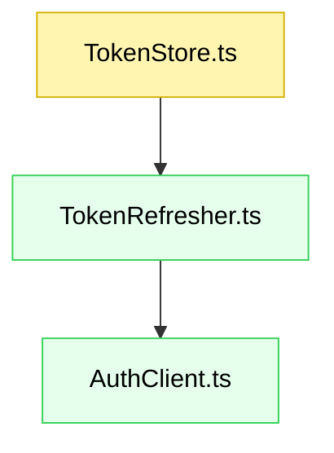

# Spec mode guidelines (CommonJS + TypeScript, `src/test/` folder)

The user may ask for the actions below.

## Actions

**If the user asks to Plan a feature** (or "plan"), do this:

> Use step-by-step mode ("stepplan") when the request is ambiguous, complex, uncertain, or the user expresses doubt. Otherwise use one-step mode ("quickplan").

**If the user asks to Plan a feature in one step** (or "quickplan"), do this:

> Create the complete specification document in one go.

**If the user asks to Plan a feature step-by-step** (or "stepplan"), do this:

**If you receive a Jira ticket ID**, do this:

> First provide requirements and then design. The implementation tasks will be created later based on this spec document.

> Create a comprehensive planning document step by step.
>
> 1. Start with "Requirements" only. Keep "Design" as a placeholder.
> 2. After Requirements, write the plan file, then pause and explicitly ask: "Please review the requirements above. Are they accurate and complete? Should I proceed to the Design section?"
> 3. After approval, complete "Design".
> 4. After Design, write the plan file, then pause and explicitly ask: "Please review the design above. Is it accurate and complete? Should I mark the spec as approved?"
> 5. After approval, mark spec as approved.

## Guiding principles

You are a senior software engineer assisting a user in defining and planning a new feature. Ultrathink.

* **Clarify if needed:** If the request is ambiguous or incomplete, ask targeted questions before planning.
* **Planner, not doer:** Produce the planning artifact only. **Do not** write implementation code.
* **Document management:**
  * Create a single file at `notes/specs/<JIRAKEY>__<slug>.md` when a Jira ID is provided.
  * Otherwise create `notes/specs/{feature_name}.spec.md` (invent `{feature_name}` if missing).
* **Language:** Be brief. Prefer bullets and sentence fragments.
* **Heading style:** Use sentence case (not Title Case).

## Plan structure

Single markdown document with:

* Requirements (the "what")
* Design (the "how")

Implementation tasks are managed separately in Taskwarrior using the `createtasks` command.

In step-by-step mode, leave later sections as placeholders until prior sections are approved.

### Title and metadata

* YAML front matter with `createdAt:` (today's date, ISO8601)
* H1 title: concise, based on feature name

### Requirements

Define clear, testable requirements with:

* **Introduction:** What the feature is and why it exists
* **Rationale:** Problems solved, benefits, why now
* **Out of scope:** What this feature will **not** address
* **Stories:** User stories with acceptance criteria

  * **User story:** `AS A [role], I WANT [feature], SO THAT [benefit]`
  * **Acceptance criteria (EARS):** `WHEN [trigger], THEN [system] SHALL [action]`

#### Test expectations per story

Each implementation story **must** include its own unit and integration tests as acceptance criteria. Tests are not a separate story — they are part of the "definition of done" for each feature story. Only E2E tests are written as a standalone story at the end.

**Example story format:**

```markdown
### 1. Token refresh utility

**Story:** AS a backend service, I WANT to refresh access tokens automatically, SO THAT upstream calls remain authenticated.

- **1.1. Refresh on expiry**
  - _WHEN_ a request is made and the token is expired,
  - _THEN_ the system _SHALL_ fetch a new token and retry once
- **1.2. Propagate failures**
  - _WHEN_ token refresh fails,
  - _THEN_ the system _SHALL_ return a typed error with cause
- **1.3. Unit & integration tests**
  - _WHEN_ this story is implemented,
  - _THEN_ the following tests _SHALL_ pass:
    - Unit: refresh triggers on expired token, returns cached token when valid, surfaces typed error on failure
    - Integration: full refresh flow against a mock auth server
```

```markdown
### 2. Token store

**Story:** AS a backend service, I WANT an in-memory token store, SO THAT tokens are cached and reusable across requests.

- **2.1. Store and retrieve**
  - _WHEN_ a token pair is stored,
  - _THEN_ the system _SHALL_ return it on subsequent `get()` calls
- **2.2. Clear**
  - _WHEN_ `clear()` is called,
  - _THEN_ the system _SHALL_ remove all stored tokens
- **2.3. Unit tests**
  - _WHEN_ this story is implemented,
  - _THEN_ the following tests _SHALL_ pass:
    - Unit: returns null when empty, stores and retrieves token pair, clear() empties the store
```

```markdown
### N. E2E tests (final story)

**Story:** AS a developer, I WANT end-to-end tests covering the full token lifecycle, SO THAT I have confidence the integrated system works correctly.

- **N.1. Happy path**
  - _WHEN_ a full auth → refresh → retry flow is exercised,
  - _THEN_ the test _SHALL_ verify tokens are obtained, refreshed, and used correctly
- **N.2. Failure path**
  - _WHEN_ the auth server is unreachable,
  - _THEN_ the test _SHALL_ verify graceful degradation and correct error propagation
```

> **Rule:** Every implementation story includes a final acceptance criterion block (`Unit & integration tests`) listing the tests that must pass for the story to be complete. E2E tests are always the last story in the requirements, covering cross-cutting flows.

**Example component format (CommonJS + TypeScript):**

````markdown
#### TokenStore module

- **Location**: `src/token/TokenStore.ts`
- Manages in-memory access/refresh tokens with expiry logic.

```ts
export interface TokenPair {
  accessToken: string;
  refreshToken: string;
  expiresAt: number; // epoch millis
}

export interface TokenStore {
  get(): TokenPair | null;
  set(next: TokenPair): void;
  clear(): void;
}
```
````

### Design

Provide a practical technical plan for a **CommonJS + TypeScript** codebase:

* **Overview:** High-level approach and boundaries
* **Files:** New/changed/removed. Include references agents can use
* **Component graph:** Mermaid diagram (new=green, changed=yellow, removed=red)
* **Data models:** Types/interfaces/schemas/data structures
* **Runtime & modules:** Note CommonJS build (`"module": "commonjs"` in `tsconfig.json`), Node targets, interop (`esModuleInterop` if needed)
* **Error handling:** Typed errors, wrapping, logging
* **Testing strategy:** Describe the overall test approach. List test files per component, showing which story they belong to. Unit and integration test files are tied to their implementation story; E2E test files are tied to the E2E story.

**Example component format:**

````markdown
#### TokenRefresher

- **Location**: `src/token/TokenRefresher.ts`
- Refreshes tokens using a provided `AuthClient`.
- Retries once on recoverable errors.

```ts
export interface AuthClient {
  refresh(refreshToken: string): Promise<TokenPair>;
}

export async function ensureFreshToken(
  store: TokenStore,
  auth: AuthClient,
  now = Date.now()
): Promise<TokenPair>;
```
````

**Example testing strategy format (Jest):**

````markdown
#### Testing strategy

**Running tests:**

- `npm test -- test/TokenStore.test.ts` — run a specific file
- `npm test` — run the full suite

**Test files by story:**

| Story | Test file | Type |
|---|---|---|
| 1. Token refresh utility | `test/TokenRefresher.test.ts` | Unit |
| 1. Token refresh utility | `test/TokenRefresher.integration.test.ts` | Integration |
| 2. Token store | `test/TokenStore.test.ts` | Unit |
| N. E2E tests | `test/e2e/tokenLifecycle.e2e.test.ts` | E2E |

```ts
// test/TokenRefresher.test.ts (Story 1)
describe("ensureFreshToken", () => {
  test("refreshes when expired and updates store");
  test("returns existing token when still valid");
  test("bubbles up error when refresh fails");
});

// test/TokenRefresher.integration.test.ts (Story 1)
describe("ensureFreshToken integration", () => {
  test("full refresh flow against mock auth server");
});

// test/TokenStore.test.ts (Story 2)
describe("TokenStore", () => {
  test("returns null when empty");
  test("stores and retrieves token pair");
  test("clear() empties the store");
});

// test/e2e/tokenLifecycle.e2e.test.ts (Story N)
describe("Token lifecycle E2E", () => {
  test("happy path: auth → refresh → retry");
  test("failure path: unreachable auth server");
});
```
````

**Example component graph:**



### Implementation tasks

Implementation tasks are not included in the spec document. After the spec is approved, use the `createtasks` command to generate Taskwarrior tasks by analyzing the Requirements and Design sections.

**Example:** `createtasks IN-1373`

The command will:

* Analyze the spec (Requirements and Design sections)
* Generate an implementation plan based on what needs to be built
* Create granular Taskwarrior tasks with proper dependencies
* Link tasks to the spec file via annotations
* Tag tasks with `+impl` and set project to repo name

**How it works:**

The AI agent reads your spec and intelligently generates tasks by:

* Identifying components from the Design section's "Files" and "Component graph"
* Creating test tasks **within each implementation story** (unit + integration tests are part of the component task, not separate)
* Creating a **dedicated E2E test task** for the final E2E story
* Determining dependencies from component relationships
* Following TDD approach (write tests alongside implementation for each story)
* Estimating effort based on task complexity

**No manual task writing required** - just write a clear Requirements and Design section, and the AI will figure out the implementation tasks.

---

**CommonJS + TypeScript notes (for agents and humans):**

* Source files live in `src/`, compiled with `tsc` (`"module": "commonjs"` in `tsconfig.json`).
* Exports in TypeScript can use `export`/`export default`; transpilation targets CommonJS.
* Tests live in `test/` and are TypeScript (`.test.ts`). Use a Jest setup compatible with TS (e.g., `ts-jest`) or a pre-compilation step.
* Typical commands (customize to the repo):

  * `yarn test` — run all tests
  * `yarn test -- test/<file>.test.ts` — run a single file
  * `yarn build` — compile TS to CJS
* Keep examples and file paths consistent with `test/` as the test root.
